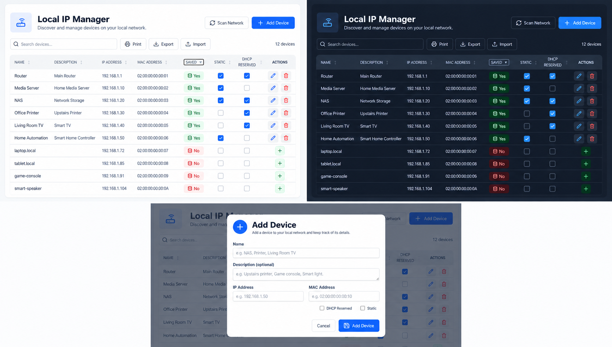

# Local IP Manager

Local IP Manager is a self-hosted Blazor application for keeping track of devices, static IP addresses, MAC addresses, and reservations on a local network.

## Why I built this

I use static IP addresses for a large number of devices, and the information was becoming difficult to manage. Some addresses were reserved in my router, some were configured through Proxmox, and many belonged to IoT devices or hosts configured manually.

There was no single place where I could see which addresses were already in use, which addresses were still available, or what a particular address actually belonged to. I built Local IP Manager to give me one clear inventory of the network, regardless of where each address was originally configured.

## Screenshots



## Features

- Maintain a central inventory of device names, descriptions, IP addresses, and MAC addresses.
- Mark addresses as reserved and identify devices configured with a static IP address.
- Scan the local IPv4 network for responding devices.
- Add discovered devices directly to the database.
- Search and sort the device list, including numeric IP-address sorting.
- Import devices from a Local IP Manager JSON export.
- Export the database inventory to JSON for backup or transfer.
- Print a clean copy of the current filtered and sorted device list.
- Create and update the SQLite database automatically through Entity Framework Core migrations.
- Run on Windows or Linux.

## Requirements

- [.NET 10 SDK](https://dotnet.microsoft.com/download/dotnet/10.0) for building and running from source.
- A Windows or Linux host connected to the network you want to scan.
- Linux network scans require the `iproute2` package for MAC-address lookup.
- Linux service accounts require permission to send ICMP packets. For a systemd service, grant only the application `CAP_NET_RAW` with `AmbientCapabilities=CAP_NET_RAW` and `CapabilityBoundingSet=CAP_NET_RAW`.

## Run from source

Clone the repository and run this command from its root:

```powershell
dotnet run --project LocalIPManager
```

Alternatively, open `LocalIPManager.slnx` in Visual Studio and run the project. Open the local URL printed by the application.

## Using the application

### Add devices manually

Select **Add Device** and enter a name and IPv4 address. Description and MAC address are optional. IP addresses and MAC addresses must be unique.

Use **Reserved** when the router or DHCP server is configured to assign the same address to a device. Use **Static** when the IP address is configured directly on the device, virtual machine, or container instead of being assigned automatically through DHCP.

### Scan the network

Select **Scan Network** to look for responding devices on the host's local IPv4 subnet. Scan results that are not already in the database can be added from the Actions column.

The scanner runs from the machine hosting Local IP Manager. It scans the first active network interface with an IPv4 gateway, and devices that block ICMP ping might not be detected. MAC-address discovery only works for devices visible on the same local network segment.

### Import and export

**Export** downloads the current database inventory as a versioned JSON file. Database IDs and temporary scan-only results are not included.

**Import** adds valid new devices from an exported JSON file. Existing records are preserved, and imported records with duplicate IP or MAC addresses are skipped. The application reports how many records were imported, skipped as duplicates, or rejected as invalid.

### Print

**Print** opens the browser's print dialog for the current filtered and sorted list. Interactive controls and the Actions column are removed from the printed view.

## Database

Local IP Manager uses SQLite. No blank database or manual schema setup is required. At startup, the application applies its Entity Framework Core migrations, creating the database and tables when necessary and applying pending migrations to an existing database.

The default connection string is defined in `LocalIPManager/appsettings.json`:

```text
Data Source=IpManagerDatabase.db
```

This places the database in the application's working directory, which must be writable. Local database files and SQLite sidecar files are intentionally excluded from Git.

For a simple file-level backup, stop the application before copying the database. A JSON export provides an additional portable backup of the device inventory.

## Publish

Create a Windows x64 self-contained build:

```powershell
dotnet publish LocalIPManager/LocalIPManager.csproj `
    -c Release `
    -r win-x64 `
    --self-contained true `
    -o artifacts/win-x64
```

Create a Linux x64 framework-dependent build:

```powershell
dotnet publish LocalIPManager/LocalIPManager.csproj `
    -c Release `
    -r linux-x64 `
    --self-contained false `
    -o artifacts/linux-x64
```

The Linux host must have the ASP.NET Core 10 runtime installed for the framework-dependent build.

## Hosting notes

For a server installation, store the SQLite database in a persistent writable directory such as `/var/lib/localipmanager` and provide the connection string through configuration or the `ConnectionStrings__DefaultConnection` environment variable.

The application currently has no user authentication. Restrict access to trusted devices with a firewall or reverse proxy if it is hosted on a shared network, and do not expose it directly to the public internet.

## License

Local IP Manager is licensed under the [MIT License](LICENSE).
